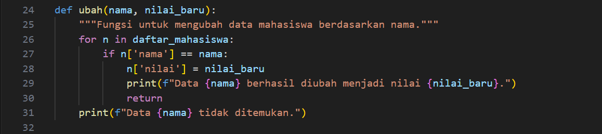

# LAPORAN PRAKTIKUM 7
DAFTAR ISI
==========
- [LAPORAN PRAKTIKUM 7](#laporan-praktikum-7) 
    - [PSEUDECODE PROGRAM DATA MAHASISWA](#pseudecode-program-data-mahasiswa)
    - [FLOWCHART DATA MAHASISWA](#flowchart-data-mahasisiswa)
    - [KESIMPULAN](#kesimpulan)

## PSEUDECODE PROGRAM DATA MAHASISWA
Berikut adalah contoh program sederhana yang mengaplikasikan fungsi untuk menampilkan daftar nilai mahasiswa. Program ini akan memiliki fungsi-fungsi seperti tambah(), tampilkan(), hapus(nama), dan ubah(nama).

### Step 1 : Menyimpan Data
Dalam Variabel "daftar_mahasiswa" ini biasanya digunakan untuk menyimpan data mahasiswa, di mana setiap entri adalah dictionary yang berisi nama dan nilai.

### Step 2 : Menambahkan Data
Dalam Fungsi ini,menampilkan semua data mahasiswa yang tersimpan. Jika list mahasiswa kosong, Maka fungsi ini mencetak pesan bahwa tidak ada data. Dan Jika ada data, Maka fungsi ini mencetak nama dan nilai setiap mahasiswa.

### Step 3 : Menampilkan Data
Kemudian ada menampilkan data, fungsi ini semua data mahasiswa yang tersimpan. Jika list mahasiswa kosong, fungsi ini mencetak pesan bahwa tidak ada data. Jika ada data, fungsi ini mencetak nama dan nilai setiap mahasiswa.

### Step 4 : Menghapus Data
Fungsi ini menghapus data mahasiswa berdasarkan nama. List comprehension digunakan untuk membuat list baru yang tidak menyertakan mahasiswa dengan nama yang diberikan. Fungsi ini juga mencetak pesan konfirmasi.

### Step 5 : Mengubah Data
Dengan ini pengguna dapat mengubah nilai mahasiswa berdasarkan nama yang diberikan. Jika nama ditemukan, nilai mahasiswa diperbarui, dan fungsi ini mencetak pesan konfirmasi. Jika tidak ditemukan, fungsi ini memberi tahu bahwa data tidak ada.

### Step 6 : Menu Utama
Dalam Fungsi ini menampilkan menu interaktif yang meminta pengguna untuk memilih operasi yang diinginkan. Berdasarkan input pengguna, fungsi ini memanggil fungsi yang sesuai (tambah, tampilkan, hapus, ubah) atau keluar dari program.

### Step 6 : Pengoperasian Program
Bagian ini memastikan bahwa fungsi menu() hanya dijalankan jika skrip ini dieksekusi secara langsung, bukan jika diimpor sebagai modul.

## FLOWCHART DATA MAHASISWA
Berikut adalah penjelasan fungsi dalam setiap bagian tertentu dari flowchart pengelolaan daftar nilai mahasiswa yang telah kita bahas sebelumnya. Setiap bagian memiliki peran penting dalam menentukan alur logika dan proses yang akan dilakukan.

### Step 1 : Mulai 
Program dimulai, dan kontrol alur berpindah ke langkah berikutnya, yaitu menampilkan menu.

### Step 2 : Tampilkan Menu
Simbol ini menunjukkan bahwa program akan menampilkan pilihan menu kepada pengguna.Misalnya Pengguna Memilih Menu dengan opsi 
1. Tambah Data
2. Tampilkan Data
3. Hapus Data
4. Ubah Data 
5. Keluar 
Yang ditampilkan di layar.Tanpa menu ini, pengguna akan bingung tentang langkah selanjutnya.

### Step 3 : Pilih Menu 
Simbol keputusan ini mengevaluasi input dari pengguna untuk menentukan pilihan menu mana yang akan diproses.Dengan Program ini pengguna dapat memeriksa input pengguna. Berdasarkan pilihan yang dimasukkan (1-5), kontrol alur akan berpindah ke langkah sesuai dengan pilihan tersebut.

### Step 4 : Proses Tambah Data
Jika pengguna memilih untuk menambah data, maka langkah ini akan dijalankan.Dengan ini Pengguna diminta untuk memasukkan nama dan nilai mahasiswa. Data tersebut kemudian disimpan dalam daftar.

### Step 5 : Data Ditambahkan
 Menandakan bahwa data telah berhasil ditambahkan ke dalam daftar mahasiswa.Dalam Program ini memberikan umpan balik kepada pengguna bahwa data telah berhasil ditambahkan, kemudian kembali ke langkah "Tampilkan Menu".

### Step 6 : Proses Tampilkan Data
Jika pengguna memilih untuk menampilkan data, maka langkah ini akan dijalankan.Dalam Menjalankan Program ini akan menampilkan semua data mahasiswa yang ada di dalam daftar. Jika daftar kosong, program akan memberi tahu pengguna.

### Step 7 : Proses Hapus Data
Jika pengguna memilih untuk menampilkan data, maka langkah ini akan dijalankan.Dengan ini Program menampilkan semua data mahasiswa yang ada di dalam daftar. Jika daftar kosong, program akan memberi tahu pengguna.

### Step 8 : Data Dihapus
Menandakan bahwa data mahasiswa telah berhasil dihapus.Dalam Program ini memberi umpan balik kepada pengguna bahwa data telah dihapus, kemudian kembali ke langkah "Tampilkan Menu".

### Step 9 : Proses Ubah Data
Jika pengguna memilih untuk mengubah data, maka langkah ini akan dijalankan. Lalu Pengguna diminta untuk memasukkan nama mahasiswa yang ingin diubah dan nilai baru. Program mencari nama tersebut dalam daftar dan mengubah nilainya jika ditemukan.

### Step 10 : Data Diubah
Menandakan bahwa data mahasiswa telah berhasil diubah.Dengan ini Program Dapat memberikan umpan balik kepada pengguna bahwa data telah diubah, kemudian kembali ke langkah "Tampilkan Menu".

### Step 11 : Keluar
Jika pengguna memilih untuk keluar, Maka langkah ini akan dijalankan. Program ini akan mengakhiri eksekusi dan menampilkan pesan bahwa program telah selesai.

### Step 12 : Pilihan Tidak Valid
Jika pengguna memasukkan pilihan yang tidak valid, langkah ini akan dijalankan.Program ini akan memberikan umpan balik bahwa pilihan tidak valid, dan kemudian kembali ke langkah "Tampilkan Menu".

Setiap bagian dalam flowchart ini berfungsi untuk memandu pengguna melalui proses dengan cara yang terstruktur. Fungsi-fungsi ini memastikan bahwa program dapat berjalan dengan lancar, memberikan umpan balik yang diperlukan, dan mengelola data dengan efisien. Dengan memahami fungsi masing-masing bagian, pengguna dan pengembang dapat lebih mudah berinteraksi dengan sistem dan mengidentifikasi area yang mungkin perlu diperbaiki atau ditingkatkan.

## kesimpulan
Secara keseluruhan, flowchart merupakan alat yang sangat berguna dalam merancang, memahami, dan mengelola proses dalam sistem. Dengan memanfaatkan flowchart, pengembang dapat menciptakan aplikasi yang lebih intuitif dan efisien, yang pada akhirnya meningkatkan nilai bagi pengguna.
